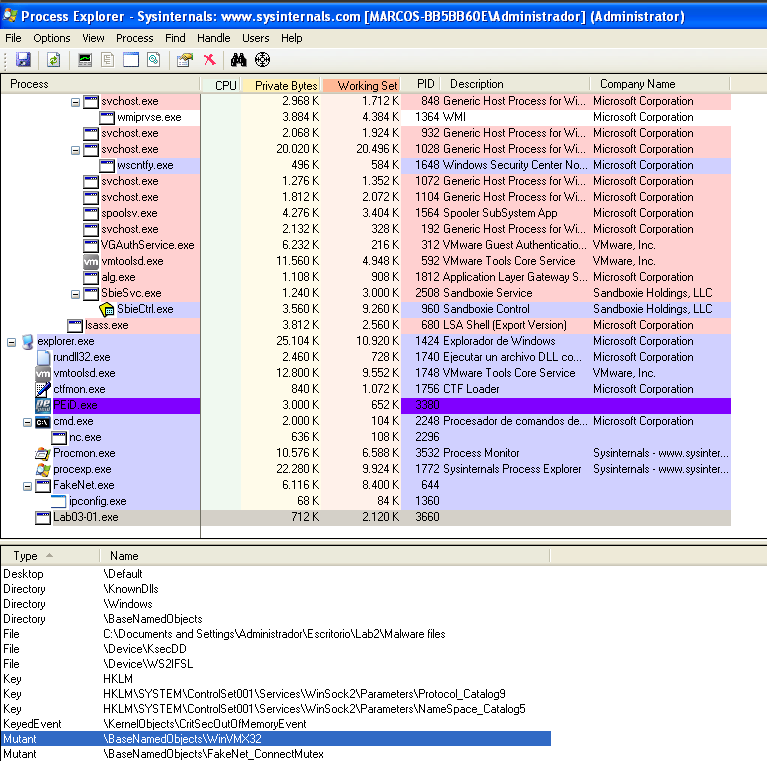

# Lab 1

## Basic Static Analysis

### Import Table - PEview

As always, we are going to see the import table by using PEview

<figure><figcaption></figcaption></figure>

As we can see, there are very few imports, so we are going to conclude:

* Malware is may packed and the import can be resolved in runtime

### Strings

We could think that we are not going to see any string because the malware is packet, however we  see many interesting strings, such as:

* registry locations&#x20;
* a domain name
* WinVMX32
* VideoDriver
* vmx32to64.exe

<figure><figcaption></figcaption></figure>

## Dynamic Analysis

### Process Monitor --> clear out all the events

<figure><figcaption></figcaption></figure>

### Process Explorer -->&#x20;
